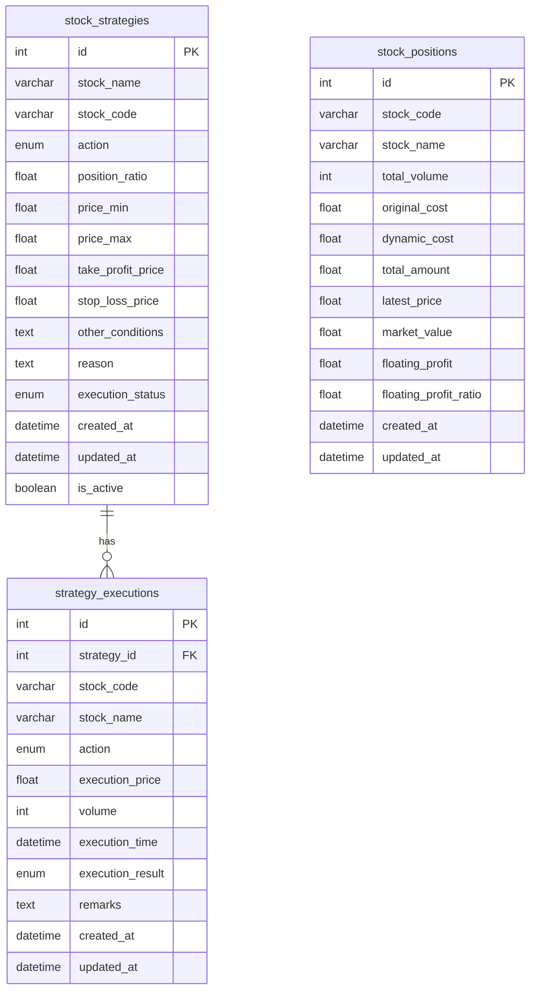

# QMT Server 数据库设计文档

## 数据库信息
- 数据库名称：stock_strategy
- 字符集：utf8mb4
- 排序规则：utf8mb4_unicode_ci

## 表结构说明

### 策略表（stock_strategies）

#### 字段说明
| 字段名 | 类型 | 说明 | 特殊值说明 |
|-------|------|------|------------|
| id | INT | 策略ID | 自增主键 |
| stock_name | VARCHAR(100) | 股票名称 | - |
| stock_code | VARCHAR(20) | 股票代码 | - |
| action | ENUM('buy', 'sell') | 执行动作 | - |
| position_ratio | FLOAT | 操作比例 | - |
| price_min | FLOAT | 最小执行价 | 可为空 |
| price_max | FLOAT | 最大执行价 | 可为空 |
| take_profit_price | FLOAT | 止盈价 | 可为空 |
| stop_loss_price | FLOAT | 止损价 | 可为空 |
| other_conditions | TEXT | 其他操作条件 | 可为空 |
| reason | TEXT | 操作理由 | 可为空 |
| execution_status | ENUM('pending', 'completed', 'partial') | 执行状态 | 未执行、已全部执行、已部分执行 |
| created_at | DATETIME | 策略制定时间 | - |
| updated_at | DATETIME | 策略修正时间 | - |
| is_active | BOOLEAN | 策略是否有效 | - |

#### 索引说明
- PRIMARY KEY (`id`)
- INDEX `idx_stock_code` (`stock_code`)
- INDEX `idx_created_at` (`created_at`)
- INDEX `idx_updated_at` (`updated_at`)
- INDEX `idx_is_active` (`is_active`)
- INDEX `idx_execution_status` (`execution_status`)

### 策略执行记录表（strategy_executions）

#### 字段说明
| 字段名 | 类型 | 说明 | 特殊值说明 |
|-------|------|------|------------|
| id | INT | 执行记录ID | 自增主键 |
| strategy_id | INT | 策略ID | 外键关联 stock_strategies 表 |
| stock_code | VARCHAR(20) | 股票代码 | - |
| stock_name | VARCHAR(100) | 股票名称 | - |
| action | ENUM('buy', 'sell') | 执行操作 | - |
| execution_price | FLOAT | 执行价格 | - |
| volume | INT | 交易量 | - |
| execution_time | DATETIME | 执行时间 | - |
| execution_result | ENUM('success', 'failed', 'partial') | 执行结果 | - |
| remarks | TEXT | 备注说明 | 可为空 |
| created_at | DATETIME | 创建时间 | - |
| updated_at | DATETIME | 更新时间 | - |

#### 索引说明
- PRIMARY KEY (`id`)
- INDEX `idx_strategy_id` (`strategy_id`)
- INDEX `idx_stock_code` (`stock_code`)
- INDEX `idx_execution_time` (`execution_time`)
- INDEX `idx_execution_result` (`execution_result`)
- FOREIGN KEY (`strategy_id`) REFERENCES `stock_strategies` (`id`) ON DELETE CASCADE

### 持仓表（stock_positions）

#### 字段说明
| 字段名 | 类型 | 说明 | 特殊值说明 |
|-------|------|------|------------|
| id | INT | 持仓ID | 自增主键 |
| stock_code | VARCHAR(20) | 股票代码 | - |
| stock_name | VARCHAR(100) | 股票名称 | - |
| total_volume | INT | 持仓数量 | - |
| original_cost | FLOAT | 原始平均成本 | - |
| dynamic_cost | FLOAT | 动态成本价 | - |
| total_amount | FLOAT | 持仓金额 | - |
| latest_price | FLOAT | 最新价格 | 可为空 |
| market_value | FLOAT | 市值 | 可为空 |
| floating_profit | FLOAT | 浮动盈亏 | 可为空 |
| floating_profit_ratio | FLOAT | 浮动盈亏比例 | 特殊值：999999（当 dynamic_cost <= 0） |
| created_at | DATETIME | 创建时间 | - |
| updated_at | DATETIME | 更新时间 | - |

#### 索引说明
- PRIMARY KEY (`id`)
- INDEX `idx_stock_code` (`stock_code`)
- INDEX `idx_updated_at` (`updated_at`)

#### 特殊值说明
1. **浮动盈亏比例（floating_profit_ratio）**
   - 正常情况：实际的盈亏比例值
   - 特殊情况：当 dynamic_cost <= 0 时，该字段值为 999999
   - 前端显示：当值为 999999 时显示为 ♾️ 符号

2. **卖出限制**
   - 卖出数量不能超过当前持仓量
   - 违反限制时会抛出业务异常

## 数据库关系图
