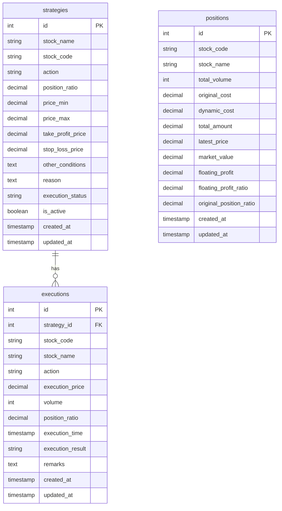

# QMT Server 数据库设计文档

## 数据库信息
- 数据库名称：stock_strategy
- 字符集：utf8mb4
- 排序规则：utf8mb4_unicode_ci

## 表结构说明

### 策略表（strategies）

#### 字段说明
| 字段名 | 类型 | 是否必填 | 默认值 | 说明 |
|--------|------|----------|---------|------|
| id | INTEGER | 是 | 自增 | 主键 |
| stock_name | VARCHAR(32) | 是 | - | 股票名称 |
| stock_code | VARCHAR(16) | 是 | - | 股票代码 |
| action | VARCHAR(8) | 是 | - | 交易动作（buy/sell/add/trim/hold） |
| position_ratio | DECIMAL(5,2) | 是 | - | 仓位比例（0-100，整数表示百分比） |
| price_min | DECIMAL(10,2) | 否 | NULL | 最低价格 |
| price_max | DECIMAL(10,2) | 否 | NULL | 最高价格 |
| take_profit_price | DECIMAL(10,2) | 否 | NULL | 止盈价格 |
| stop_loss_price | DECIMAL(10,2) | 否 | NULL | 止损价格 |
| other_conditions | TEXT | 否 | NULL | 其他条件 |
| reason | TEXT | 否 | NULL | 操作理由 |
| execution_status | VARCHAR(16) | 是 | 'pending' | 执行状态（pending/partial/completed） |
| is_active | BOOLEAN | 是 | TRUE | 是否有效 |
| created_at | TIMESTAMP | 是 | CURRENT_TIMESTAMP | 创建时间 |
| updated_at | TIMESTAMP | 是 | CURRENT_TIMESTAMP | 更新时间 |

#### 索引说明
- PRIMARY KEY (id)
- INDEX idx_stock_code (stock_code)
- INDEX idx_created_at (created_at)
- INDEX idx_updated_at (updated_at)
- INDEX idx_execution_status (execution_status)

#### 操作类型说明
- `buy`: 买入/建仓 - 初始建仓操作，会创建新的持仓记录
- `sell`: 卖出/清仓 - 减少或清空持仓的操作
- `add`: 加仓 - 在现有持仓基础上增加的操作
- `trim`: 减仓 - 部分减少持仓的特殊操作
- `hold`: 持有 - 不进行实际交易，仅记录策略的操作

### 策略执行记录表（executions）

#### 字段说明
| 字段名 | 类型 | 是否必填 | 默认值 | 说明 |
|--------|------|----------|---------|------|
| id | INTEGER | 是 | 自增 | 主键 |
| strategy_id | INTEGER | 是 | - | 策略ID |
| stock_code | VARCHAR(16) | 是 | - | 股票代码 |
| stock_name | VARCHAR(32) | 是 | - | 股票名称 |
| action | VARCHAR(8) | 是 | - | 交易动作（buy/sell/add/trim/hold） |
| execution_price | DECIMAL(10,2) | 是 | - | 执行价格 |
| volume | INTEGER | 是 | - | 交易量 |
| position_ratio | DECIMAL(5,2) | 否 | NULL | 仓位比例（0-100，整数表示百分比） |
| execution_time | TIMESTAMP | 是 | CURRENT_TIMESTAMP | 执行时间 |
| execution_result | VARCHAR(16) | 是 | - | 执行结果（success/failed/partial） |
| remarks | TEXT | 否 | NULL | 备注说明 |
| created_at | TIMESTAMP | 是 | CURRENT_TIMESTAMP | 创建时间 |
| updated_at | TIMESTAMP | 是 | CURRENT_TIMESTAMP | 更新时间 |

#### 索引说明
- PRIMARY KEY (id)
- FOREIGN KEY (strategy_id) REFERENCES strategies(id)
- INDEX idx_stock_code (stock_code)
- INDEX idx_execution_time (execution_time)
- INDEX idx_created_at (created_at)

#### 交易量计算规则
- `buy`/`add`: 根据总资产和仓位比例计算 - 交易量 = 总资产 × 仓位比例 ÷ 价格
- `sell`: 根据当前持股量和卖出比例计算 - 交易量 = 当前持股量 × 卖出比例
- `trim`: 根据当前持股量、原始仓位比例和目标减仓比例计算 - 交易量 = 当前持股量 × (减仓比例 ÷ 原始买入仓位比例)
- `hold`: 交易量为 0，不进行实际交易

### 持仓表（positions）

#### 字段说明
| 字段名 | 类型 | 是否必填 | 默认值 | 说明 |
|--------|------|----------|---------|------|
| id | INTEGER | 是 | 自增 | 主键 |
| stock_code | VARCHAR(16) | 是 | - | 股票代码 |
| stock_name | VARCHAR(32) | 是 | - | 股票名称 |
| total_volume | INTEGER | 是 | 0 | 总持仓量 |
| original_cost | DECIMAL(10,2) | 是 | 0 | 原始成本 |
| dynamic_cost | DECIMAL(10,2) | 是 | 0 | 动态成本 |
| total_amount | DECIMAL(12,2) | 是 | 0 | 总金额 |
| latest_price | DECIMAL(10,2) | 是 | 0 | 最新价格 |
| market_value | DECIMAL(12,2) | 是 | 0 | 市值 |
| floating_profit | DECIMAL(12,2) | 是 | 0 | 浮动盈亏 |
| floating_profit_ratio | DECIMAL(10,4) | 是 | 0 | 盈亏比例 |
| original_position_ratio | DECIMAL(5,2) | 否 | NULL | 原始仓位比例（0-100，整数表示百分比） |
| created_at | TIMESTAMP | 是 | CURRENT_TIMESTAMP | 创建时间 |
| updated_at | TIMESTAMP | 是 | CURRENT_TIMESTAMP | 更新时间 |

#### 索引说明
- PRIMARY KEY (id)
- UNIQUE INDEX idx_stock_code (stock_code)
- INDEX idx_created_at (created_at)
- INDEX idx_updated_at (updated_at)

#### 特殊值说明
1. **浮动盈亏比例（floating_profit_ratio）**
   - 正常情况：实际的盈亏比例值
   - 特殊情况：当 dynamic_cost <= 0 时，该字段值为 999999
   - 前端显示：当值为 999999 时显示为 ♾️ 符号

2. **卖出限制**
   - 卖出数量不能超过当前持仓量
   - 违反限制时会抛出业务异常

3. **持仓更新规则**
   - `buy`: 创建新的持仓记录，记录原始仓位比例
   - `add`: 增加持仓数量并更新平均成本
   - `sell`: 减少持仓数量，如果卖出全部则删除持仓记录
   - `trim`: 减少持仓数量，但保持平均成本不变
   - `hold`: 不影响持仓记录

## 数据库关系图
