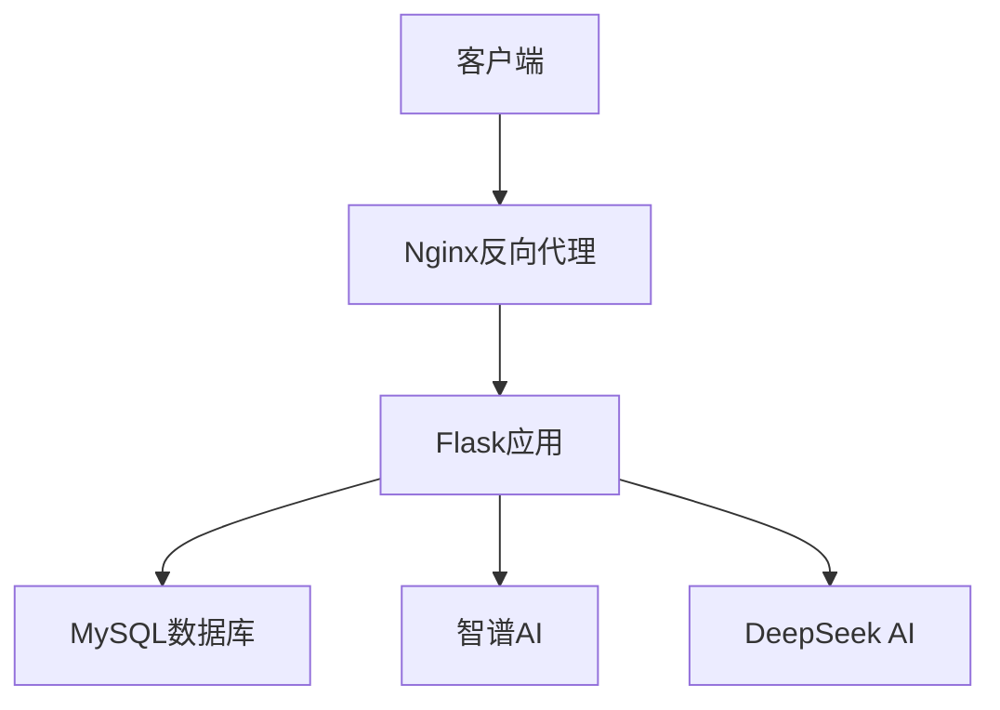

## 系统更新记录

### 2024-02-15 更新
1. **浮动盈亏比例显示优化**
   - 当动态成本小于等于0时，数据库中记录为999999
   - 前端页面显示为 ♾️ 符号
   - 优化了总盈亏比例的计算逻辑

2. **持仓卖出安全机制**
   - 增加了双重验证机制，防止超量卖出
   - 在服务层和模型层都增加了数量验证
   - 添加了友好的错误提示

3. **前端展示优化**
   - 优化了持仓列表的总计行显示
   - 修复了重复显示总计行的问题
   - 统一了数值的格式化显示 

# 部署文档

## 1. 环境要求

- Python 3.10+
- MySQL 8.0+
- Git
- 推荐使用 PyCharm 或 VSCode 作为开发工具

## 2. 安装步骤

### 2.1 克隆代码
```bash
git clone https://github.com/your-username/QMT_Server.git
cd QMT_Server
```

### 2.2 创建虚拟环境
```bash
python -m venv venv
# Windows
venv\Scripts\activate
# Linux/Mac
source venv/bin/activate
```

### 2.3 安装依赖
```bash
pip install -r requirements.txt
```

### 2.4 配置环境变量
复制 `.env.example` 为 `.env`，并修改相关配置：
```ini
# 数据库配置
DB_HOST=localhost
DB_PORT=3306
DB_NAME=qmt_server
DB_USER=your_username
DB_PASSWORD=your_password

# AI配置
ZHIPU_API_KEY=your_zhipu_api_key
DEEPSEEK_API_KEY=your_deepseek_api_key

# 应用配置
FLASK_APP=app.py
FLASK_ENV=development
FLASK_DEBUG=1
```

### 2.5 初始化数据库
```bash
# 创建数据库
mysql -u root -p
CREATE DATABASE qmt_server CHARACTER SET utf8mb4 COLLATE utf8mb4_unicode_ci;

# 初始化表结构
python scripts/init_db.py
```

## 3. 启动服务

### 3.1 开发环境
```bash
flask run
```

### 3.2 生产环境
使用 gunicorn 或 uwsgi 作为 WSGI 服务器：

```bash
# 使用 gunicorn
gunicorn -w 4 -b 0.0.0.0:5000 app:app

# 使用 uwsgi
uwsgi --ini uwsgi.ini
```

## 4. 配置说明

### 4.1 数据库配置
在 `config/settings.py` 中配置数据库连接：
```python
SQLALCHEMY_DATABASE_URI = f"mysql+pymysql://{DB_USER}:{DB_PASSWORD}@{DB_HOST}:{DB_PORT}/{DB_NAME}"
SQLALCHEMY_TRACK_MODIFICATIONS = False
SQLALCHEMY_ECHO = True if FLASK_ENV == 'development' else False
```

### 4.2 AI配置
在 `config/settings.py` 中配置 AI 服务：
```python
ZHIPU_API_KEY = os.getenv('ZHIPU_API_KEY')
ZHIPU_API_URL = "https://api.zhipu.ai/v1/chat/completions"

DEEPSEEK_API_KEY = os.getenv('DEEPSEEK_API_KEY')
DEEPSEEK_API_URL = "https://api.deepseek.com/v1/chat/completions"
```

### 4.3 日志配置
在 `config/settings.py` 中配置日志：
```python
LOG_LEVEL = 'DEBUG' if FLASK_ENV == 'development' else 'INFO'
LOG_FORMAT = '%(asctime)s - %(name)s - %(levelname)s - %(message)s'
LOG_FILE = 'logs/app.log'
```

## 5. 部署架构



## 6. 监控和维护

### 6.1 日志监控
- 应用日志：`logs/app.log`
- 错误日志：`logs/error.log`
- 访问日志：`logs/access.log`

### 6.2 数据库备份
```bash
# 备份数据库
mysqldump -u root -p qmt_server > backup/qmt_server_$(date +%Y%m%d).sql

# 恢复数据库
mysql -u root -p qmt_server < backup/qmt_server_20240201.sql
```

### 6.3 性能监控
使用 Prometheus + Grafana 监控系统性能：
- CPU 使用率
- 内存使用率
- 磁盘使用率
- 请求响应时间
- 错误率
- QPS

## 7. 常见问题

### 7.1 端口占用
如果 5000 端口被占用，请不要修改端口，而是：
1. Windows: 使用 `netstat -ano | findstr 5000` 找到占用进程
2. Linux: 使用 `lsof -i:5000` 找到占用进程
3. 结束占用进程后重新启动服务

### 7.2 数据库连接失败
1. 检查数据库服务是否启动
2. 检查数据库用户名密码是否正确
3. 检查数据库主机和端口是否正确
4. 检查防火墙设置

### 7.3 AI服务调用失败
1. 检查 API Key 是否正确
2. 检查网络连接是否正常
3. 检查 API 调用频率是否超限
4. 检查 API 余额是否充足

## 8. 安全配置

### 8.1 数据库安全
1. 使用强密码
2. 限制数据库访问IP
3. 定期更新密码
4. 定期备份数据

### 8.2 应用安全
1. 使用 HTTPS
2. 启用 CSRF 保护
3. 设置合理的 Session 超时
4. 限制 API 访问频率

### 8.3 服务器安全
1. 及时更新系统补丁
2. 配置防火墙规则
3. 使用 SSH Key 登录
4. 禁用 root 远程登录 